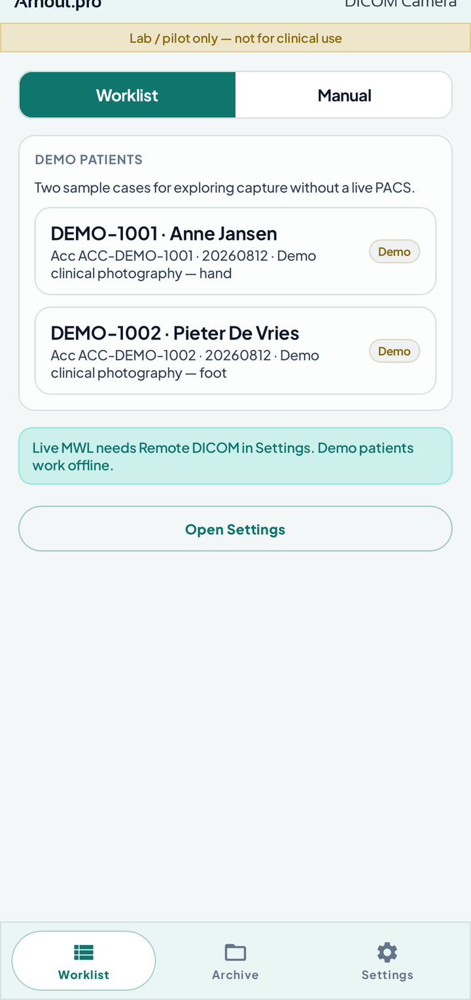
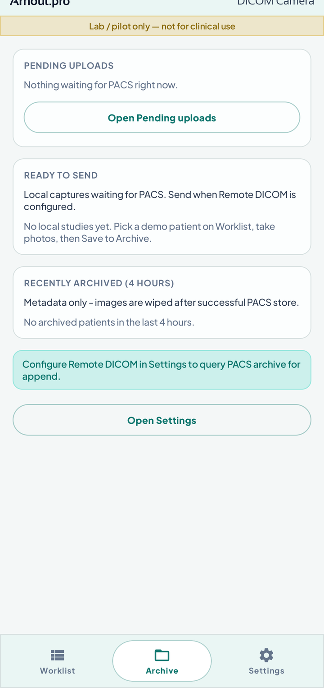
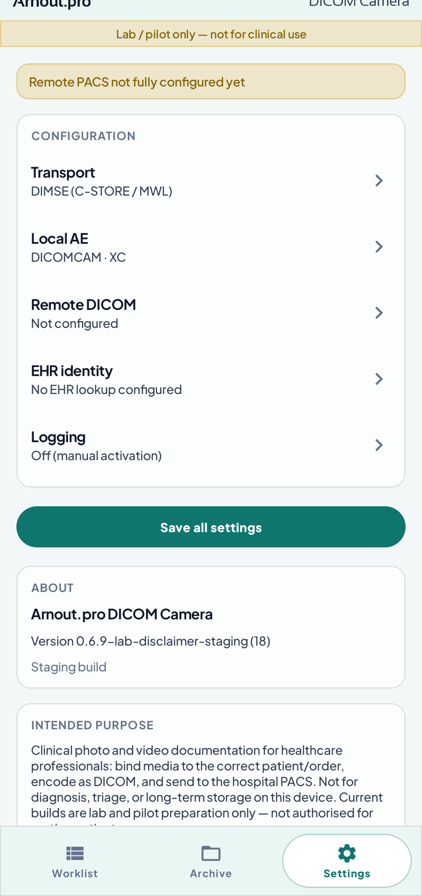
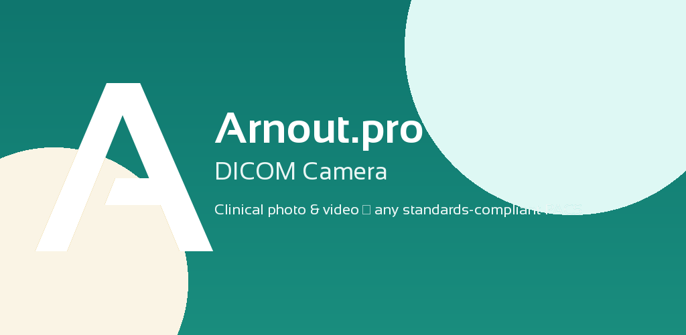

# Arnout.pro DICOM Camera

<p align="center">
  
</p>

<p align="center">
  <strong>Android clinical camera for hospitals</strong><br/>
  Capture photos &amp; video → bind to the right patient/order → store as DICOM to any standards-compliant PACS → wipe the device.
</p>

<p align="center">
  <a href="docs/compliance/DICOM_CONFORMANCE_STATEMENT.md">DICOM Conformance Statement</a> ·
  <a href="DISCLAIMER.md">Disclaimer (lab only)</a> ·
  <a href="LICENSE">Apache 2.0</a> ·
  <a href="docs/PRODUCT_PLAN.md">Product plan</a> ·
  <a href="docs/deploy/IT_DEPLOYMENT_GUIDE.md">IT deployment</a> ·
  <a href="branding/play-store/">Play Store assets</a>
</p>

> **Lab / pilot only — not for clinical use.** See [`DISCLAIMER.md`](DISCLAIMER.md).

---

## Screenshots

<p align="center">
  
  &nbsp;
  
  &nbsp;
  
</p>

<p align="center">
  <sub>Worklist · Archive · Settings — staging lab build (not for clinical use)</sub>
</p>

---

## Why this exists

Clinical photos still end up in insecure channels (chat apps, personal cameras, gallery sync). Hospitals need a **modality-like** Android app that:

1. Speaks **real DICOM** (and optional DICOMweb) to whatever PACS/VNA they already run  
2. Resolves identity via **MWL**, **PACS query**, **FHIR**, or **HL7** — not proprietary lock-in  
3. Leaves **no durable PHI** on the phone after a successful store  

**Arnout.pro DICOM Camera** is built for that workflow — Android-first, EU/NL compliance-aware, MDM-deployable.

| | Typical photo apps | This project |
|---|---|---|
| Archive | Gallery / cloud | **PACS / VNA only** |
| Identity | Manual typing | **MWL · Study query · FHIR · HL7 façade** |
| After send | Copies remain | **Wipe after PACS ACK** |
| PACS lock-in | Often vendor-tied | **DIMSE + DICOMweb standards** |
| Platform | Mixed | **Android (MVP)** |

---

## Features

### Capture & encode
- CameraX **photo** and **video** in one exam session  
- **VL Photographic Image Storage** (JPEG Baseline)  
- **Video Photographic Image Storage** (MPEG-4 AVC/H.264 / `MPEG4HP41`)  
- Session tray, review, batch store, pending retry queue  

### Identity & workflow
- **Modality Worklist** (DIMSE C-FIND) with date picker & filters  
- **Append to existing study** (Study Root C-FIND / QIDO-RS)  
- **Manual / emergency** path when no order exists  
- **FHIR R4 Patient** lookup + **HL7 HTTPS façade** demographics  
- Demo patients for offline exploration  

### Integration
- **DIMSE:** archive C-ECHO / C-STORE / Study FIND, plus a separate MWL C-FIND destination  
- **DICOMweb:** QIDO-RS + STOW-RS (selectable per site)  
- Android **Managed Configurations** (MDM) for AE Titles, hosts, EHR endpoints  
- **ATNA-style** audit export (system save dialog)  

### Privacy by design
- App-private staging only — **never** the system gallery  
- Wipe local pixels after successful store  
- Clear lab-only banner + Settings → About (purpose, AVG, MDR/DPIA)  

---

## Architecture (high level)

```
┌──────────────────────────────────────────────────────────┐
│  Android app (Kotlin · Jetpack Compose · CameraX)        │
│  Worklist / Manual / EHR → Capture → Encode → Store → Wipe│
└──────────────┬───────────────────────────┬───────────────┘
               │                           │
        Identity (optional)         Imaging (required)
        FHIR HTTPS / HL7 façade     DIMSE and/or DICOMweb
               │                           │
               ▼                           ▼
        EPD / interface engine      Any standards-compliant PACS
               │                           ▲
               └──────── MWL SCP (RIS) ────┘
```

Modules: `:app` · `:dicom` (dcm4che) · `:identity` (FHIR/HL7 clients).

---

## Standards & docs

| Topic | Document |
|---|---|
| DICOM networking & SOP classes | [`docs/compliance/DICOM_CONFORMANCE_STATEMENT.md`](docs/compliance/DICOM_CONFORMANCE_STATEMENT.md) **v1.0** |
| Product roadmap & phases | [`docs/PRODUCT_PLAN.md`](docs/PRODUCT_PLAN.md) |
| Hospital IT / MDM | [`docs/deploy/IT_DEPLOYMENT_GUIDE.md`](docs/deploy/IT_DEPLOYMENT_GUIDE.md) |
| HL7 façade contract | [`docs/deploy/HL7_FACADE_CONTRACT.md`](docs/deploy/HL7_FACADE_CONTRACT.md) |
| Mirth channels (HL7 façade; Orthanc keeps store) | [`docs/deploy/MIRTH_CHANNELS.md`](docs/deploy/MIRTH_CHANNELS.md) |
| IHE SWF / WIC notes | [`docs/ihe/`](docs/ihe/) |
| NL/EU compliance pack (drafts) | [`docs/compliance/PHASE5_COMPLIANCE_PACK.md`](docs/compliance/PHASE5_COMPLIANCE_PACK.md) |
| Lab Orthanc + EHR harnesses | [`lab/README.md`](lab/README.md) |

**Honest compliance status:** technical DICOM behaviour is documented. **MDR classification**, **signed DPIA/GEB**, and **verwerkersovereenkomst** with each zorginstelling are **required before real-patient use**. Lab/pilot-prep builds only until those are signed off.

---

## Quick start (developers)

**Requirements:** JDK 17+, Android SDK, optional Docker for the lab.

```bash
./gradlew :identity:testDebugUnitTest :dicom:testDebugUnitTest :app:testDevDebugUnitTest
./gradlew :app:assembleStagingDebug
# APK → app/build/outputs/apk/staging/debug/
```

### Local PACS + EHR demo harnesses

```bash
cd lab
docker compose up -d --build
./demo-ehr-lookup.sh
```

| Service | Port | Use |
|---|---|---|
| Orthanc | `4242` / `8042` | DICOM store / UI (`/ohif/` needs trailing slash) |
| HAPI FHIR | `8080` | Patient `999888777` |
| HL7 façade mock | `8090` | Patient `123456789` |

Emulator Settings → EHR: `http://10.0.2.2:8080/fhir` and `http://10.0.2.2:8090`.  
Use a **dev** flavor APK for those HTTP URLs (staging blocks cleartext).  
Physical device: use your lab host LAN IP.

Default DIMSE (dev flavor): host `10.0.2.2`, port `4242`, called AE `ORTHANC`, calling AE `DICOMCAM`.

---

## Branding & Play Store assets

Ready for a future Google Play listing and GitHub social preview:

| Asset | Size | Path |
|---|---|---|
| **Play icon** | **512 × 512** | [`branding/play-store/icon-512.png`](branding/play-store/icon-512.png) |
| **Play feature graphic** | **1024 × 500** | [`branding/play-store/feature-graphic-1024x500.png`](branding/play-store/feature-graphic-1024x500.png) |
| GitHub / OG banner | 1280 × 640 | [`branding/github-banner-1280x640.png`](branding/github-banner-1280x640.png) |
| README hero | 1280 × 320 | [`branding/readme-hero-1280x320.png`](branding/readme-hero-1280x320.png) |

<p align="center">
  
  &nbsp;&nbsp;
  
</p>

Typography: **Sansation** (SIL OFL) — see [`docs/licenses/SIL-OFL-Sansation.txt`](docs/licenses/SIL-OFL-Sansation.txt).  
In-app chrome: **Arnout.pro** (Bold) left · **DICOM Camera** (Regular) right.

Details: [`branding/README.md`](branding/README.md).

---

## Repository map

```
app/          Compose UI, CameraX, settings, MDM
dicom/        Encode, DIMSE, DICOMweb, audit, staging wipe
identity/     PatientDirectory — MWL, FHIR, HL7 façade
lab/          Orthanc + HAPI FHIR + HL7 mock
docs/         Plan, compliance, deploy, IHE, ADRs
branding/     Icons, banners, Play Store graphics
```

---

## Roadmap snapshot

Phases **0–5** are implemented in-repo (foundations → store → worklist/append → video/session → dual-stack/MDM/ATNA → FHIR/HL7 + compliance drafts).

**Still outside the phone for production pilots:**
- MDR classification with counsel  
- DPIA/GEB + verwerkersovereenkomst per site  
- Validation against a second commercial PACS/VNA  
- Organisational DICOM UID root (replace temporary `2.25.*`)  

---

## Contributing / contact

This repository is prepared for a **public** audience: hospitals, PACS engineers, and Android developers interested in standards-based clinical imaging on mobile.

- See [`CONTRIBUTING.md`](CONTRIBUTING.md) for how to report bugs and open PRs  
- See [`SECURITY.md`](SECURITY.md) for vulnerability reporting (no PHI in public issues)  
- Prefer standards (DICOM / FHIR / HL7 / IHE) over vendor-specific shortcuts  
- Never commit real patient data or production credentials  

**Project:** [arnoutpro/dicomcamera](https://github.com/arnoutpro/dicomcamera)  
**Brand:** [Arnout.pro](https://arnout.pro)

---

## License

Licensed under the **Apache License 2.0** — see [`LICENSE`](LICENSE).

**Not for clinical use** until your organisation completes applicable regulatory and privacy steps. Read [`DISCLAIMER.md`](DISCLAIMER.md) before deploying or testing with any patient data.

**Sansation** font: SIL Open Font License 1.1 (`docs/licenses/SIL-OFL-Sansation.txt`).
